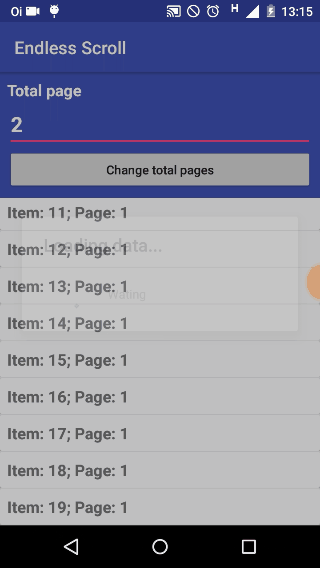

# Android Endless Scroll

This project is a EndlessScroll for using on RecyclerView


## Preview

*The ProgressDialog is optional



This project has a sample

## Integrating into your project

This project is available in [JitPack.io](https://jitpack.io/) repository.

## Add into build.gradle
```java
allprojects {
    repositories {
        jcenter()
        maven { url "https://jitpack.io" }
    }
}
```
## Add into app/build.gradle
```java
dependencies {
  compile 'com.github.rafaelcrz:android_scroll_endless:master-SNAPSHOT'
}
```

## Usage

* Configure the RecyclerView with the Adapter and LayoutManager before use the ScrollEndeless
```java
recyclerView.setAdapter(adapter);
recyclerView.setLayoutManager(layoutManager);
```
* Declare ScrollEndless like this
```java
endless = new ScrollEndless(mContext, recyclerView, layoutManager);
```

* Set the total page. Default is 1
The total pages value you can get it from your response, setting in a global variable.
```java
endless.setTotalPage(total);
```
                
* This is importante. Make your requestCall before get the EndlessListener. For popule the adapter.
```java
yourRequestCall();
```
* Get the ScrollEndless listener. 

```java
endless.addScrollEndless(new EndlessListener() {
    @Override
    public void onLoadMore() {
        //Get the next page when is available
        yourRequestMethod();
    }

    @Override
    public void onLoadAllFinish() {
        //Is the last page. Load all itens
    }
});
```
* In your requestMetohd, is very important set the following methods.
In your requestMethod, before 'response', use it: 
The ScrollEndless needs know when the request is executing.
```java
endless.isLoading(true);
``` 

If you want, use it for show a simple ProgressDialog
```java
endless.showProgressDialog("title", "message", cancelable: boolean); 
``` 
For close it, use
```java 
endless.closeProgressDialog() 
```

In the onResponse or when the data item are complete in adapter
```java
endless.isLoading(false); 
```

If you want, use it for close the ProgressDialog
```java 
endless.closeProgressDialog(); 
```

Set the next Page (before the increment)
```java
endless.setPage(page);
```

Increment the page
```java
page = endless.getPage() + 1;
```
